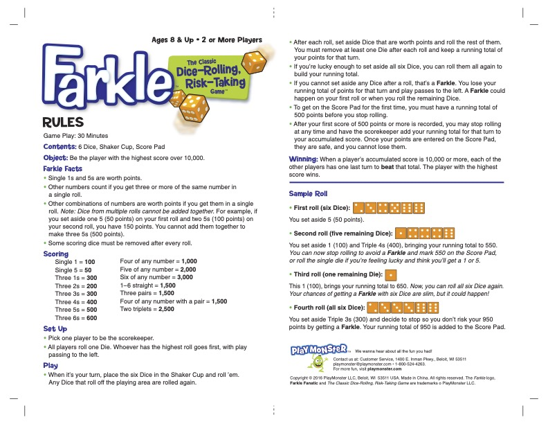

# farkle

I intend to create a way to play farkle in a website form

## Official Farkle Rules

The plan is to make it so I can adjust the rules a bit, to try out variations as well. A common "house-rule" I have is that Three 1s is 1000, and Four 1s is 1100, which we feel is more fair based on the standard amount for a single 1.

## Features

### Game Play
Be able to play a game to get to a score (getting to 10,000)

### High Score List
Maintain a listing of the top scores that have been achieved

### Personal Game Play List
Authenticate and see the scores you have had
Potentially resume a game you had in progress
